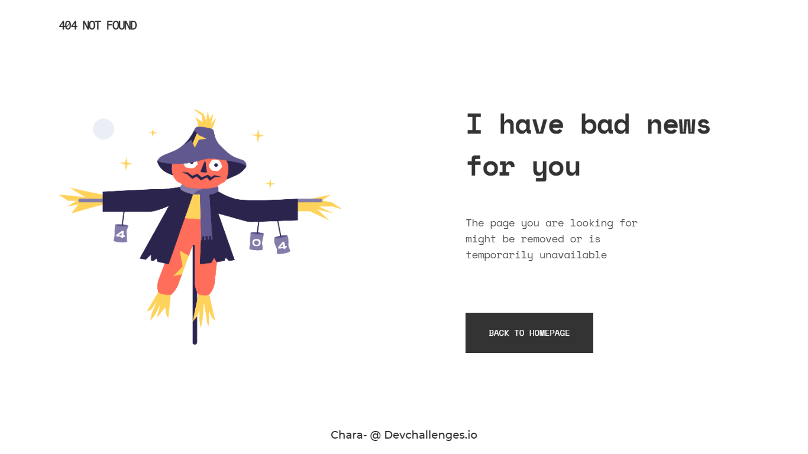

<!-- Please update value in the {}  -->

<h1 align="center">404 Not Found</h1>

<div align="center">
   Solution for a challenge from  <a href="http://devchallenges.io" target="_blank">Devchallenges.io</a>.
</div>

<div align="center">
  <h3>
    <a href="https://404-not-found-ten.vercel.app/">
      Demo
    </a>
    <span> | </span>
    <a href="https://devchallenges.io/solutions/qA2eytNsB9KXa8rQzNEF">
      Solution
    </a>
    <span> | </span>
    <a href="https://devchallenges.io/challenges/wBunSb7FPrIepJZAg0sY">
      Challenge
    </a>
  </h3>
</div>

<!-- TABLE OF CONTENTS -->

## 🔥 Table of Contents

- [Overview](#overview)
  - [Built With](#built-with)
- [Features](#features)
- [How to use](#how-to-use)
- [Contact](#contact)
- [Acknowledgements](#acknowledgements)

<!-- OVERVIEW -->

## 🎨 Overview

<details>
  <summary>💻 Desktop version</summary>
    
  

</details>

<details>
  <summary>📱 Mobile version</summary>


</details>

### Built With ⚛️

- [React](https://reactjs.org/)
- [Styled Component](https://styled-components.com/)

## 🎉 Features

This application/site was created as a submission to a [DevChallenges](https://devchallenges.io/challenges) challenge. The [challenge](https://devchallenges.io/challenges/TtUjDt19eIHxNQ4n5jps) was to build an application to complete the following user stories:

- [x] User story: This is a completed user stories
- [ ] User story: This is a incompleted user stories
- [ ] User story: This is a incompleted 2nd user stories

## 🚀 How To Use

To clone and run this application, you'll need [Git](https://git-scm.com) and [Node.js](https://nodejs.org/en/download/) (which comes with [npm](http://npmjs.com)) installed on your computer. From your command line:

```bash
# Clone this repository
$ git clone https://github.com/your-user-name/your-project-name

# Install dependencies
$ npm install

# Run the app
$ npm start
```

## ⚡️ Acknowledgements

- [Steps to replicate a design with only HTML and CSS](https://devchallenges-blogs.web.app/how-to-replicate-design/)
- [Marked - a markdown parser](https://github.com/chjj/marked)

## 👨‍💻 Contact

- GitHub [@jcarlos0511](https://github.com/jcarlos0511)
- Twitter [@charalopez0511](https://twitter.com/charalopez0511)
